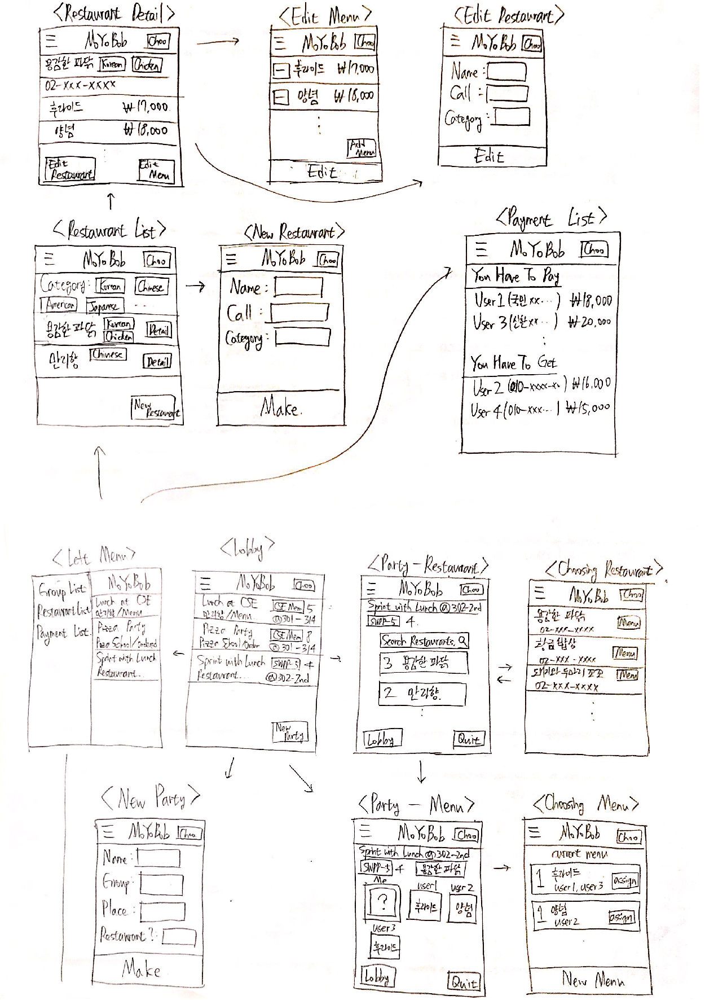

Requirements and Specification Document  
2018-10-08, version 1.0

## Revisions

- 1.0 2018-10-08 - initial document :tada:

## Project Abstract

Students who spend most of the time in the CSE club room usually do not go to the school restaurant but order a delivery meal together. In circumstances where many people gather to eat together at the same place, problems like the following occur:

- How to gather people to eat together
  - Someone needs to have enough people("party") to eat together because one or two might be inefficient.
  - When Someone who is not in the CSE student room wants to join the party, he/she should ask the people in the room in advance.
- Choosing a restaurant and picking menus
  - Someone must search for the flyer to find the restaurant list.
  - Each person has a preferred and/or disliked restaurant and they have to choose a restaurant among them.
  - They must look at the flyer to get the information like the menus they can order, the cost they have to pay etc.
- Ordering by call
  - Someone has to ask every person's menu and inform to the restaurant.
- Payment
  - Each person has to remember what he/she ordered and how much he/she have to pay, and the person who paid for the entire meal has to retrieve some amount of money for every person.

Web service __Moyobob__ aims to offer services that ease the procedure of gathering people, choosing the restaurant and the menus, ordering foods, and collecting the bill, when people gather to eat delivery foods at the student room, the club room, the lab etc.

## Customer
- __Moyobob__ is a service for people who eat delivery foods everyday in SNU CSE student room. 
- But we also concern about scalability to other groups like other departments or circles. __Moyobob__ aims to be a service for everyone who would like to eat delivery foods together.

## Competitive Landscape
- SimpleRemittanceApp (e.g.Toss, KakaoPay)
  - differentiated by giving functions for organizing people and decision making(choosing restaurant, menu).

- DeliveryApp (e.g.Yogiyo, Baemin)
  - differentiated by giving functions for organizing people and collecting a bill.

- MessengerApp (e.g.KakaoTalk, Slack)
  - differentiated by giving functions for decision making and collecting a bill.

## User Stories

## Creating Group

- As a User, I want to create a new Group, so that I can invite people to my group.
1. Given that I'm a registered user
1. When I open the Groups page
1. Then the system shows the list of groups I joined
1. And the system shows Create Group button
1. When I click the Create Group button
1. Then the system leads me to Create Group page
1. When I fill in the group information such as group name, brief information, etc
1. And I click the Create button
1. Then the system create a new group with the submitted information
1. And the system leads me to Groups page
1. Then I can see the created group on the group list

## Starting a new Party

- As a CSE student, I want gather people in CSE room, so that I can eat dinner with them.
1. Given I am already in CSE room
1. When I offer people in CSE room to join me and eat together
1. And I found some people to join me
1. Then I open Moyobob
1. When I click the Start Party button
1. Then the system shows Start Party page
1. When I fill in the party informations
1. And I set the party as Group-Opened Party
1. And I assign the party as CSE-room Group
1. And I click the Start button
1. Then the system create a new party with the submitted information
1. And the system leads me to the Party page
1. When I notify other people that I've created new Party
1. Then the other people open Moyobob
1. And they join the Party

## Choosing Restaurant

- As a Party Leader, I want to gather Restaurant preference of other Users in Party, so that I can confirm what Restaurant to order.
1. Given that I'm a Party Leader already participating in Party
1. And the Party I joined is in state of Choosing Restaurant
1. When I open the Party Page
1. Then the system leads me to Choosing Restaurant page
1. And the system shows search bar for searching Restaurants
1. When each Users in the Party choose prefered Restaurants
1. Then the system shows the list of chosen Restaurants in most prefered one on top
1. When I, the Party Leader, select one of the Restaurant
1. Then the system shows me confirmation pop-up
1. When I click on confirm
1. Then the system fixes the Restaurant to our Party
1. And the system leads the Party's state to Choosing Menu

## Choosing Menus

- As a Party member, I want to select a Menu for myself
1. Given that I'm a Party member already participating in Party
1. And the Party I am participating is in the state of Choosing Menu
1. When I open the Party Page
1. Then the system leads me to Choosing Menu page
1. And the system shows boxes for each menu which has menu name, select box for quantity and OK button.
1. When I choose a Menu and quantity, I click OK button
1. Then the system shows me assign pop-up
1. I can assign the menu for myself or friend or all members in the Party
1. When I assign the menu for myself and click OK button
1. Then the system shows me the present situation which tells me what I choose and how much I have to pay, what other members choose and total amount. 
1. When all member finish to choose menu, the Party Leader ends the state by clicking next state button
1. And the system leads the Party's state to ordering

## After the delivery arrived

- As a Party Leader, I want to inform to the system that the meal has arrived and designate a User who paid for the meal.
1. Given that I am a Party Leader already participating in Party
1. And the Party I am participating is in state of Ordered
1. When I open the Party page
1. Then the system shows a button that reads "Arrival Complete"
1. When I click on that button
1. Then the system shows a list of all Users participating in Party
1. When I select a User who paid
1. Then the system requests every User except the designated user to send respective amount of money

## Payment and Collection

- As a user who paid for the meal, I want to request a money retrieval.
1. Given that I am a user already participating in Party
1. And the Party I am participating is in state of Payment and Collection
1. When I open the Party Page
1. Then the system shows for me buttons that read "Payment Complete" to every other User
1. And the system shows for others the related information
1. When I click on a "Payment Complete" button of a specific User
1. Then the system hides the request for that User
1. And the system shows for me and that User a Payment Complete message

## User Interface Requirements

