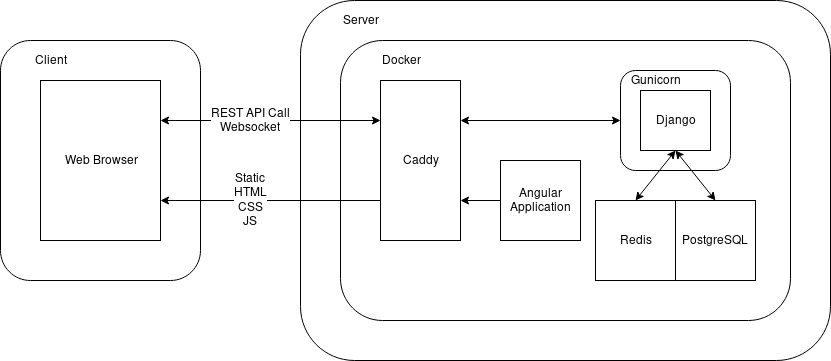
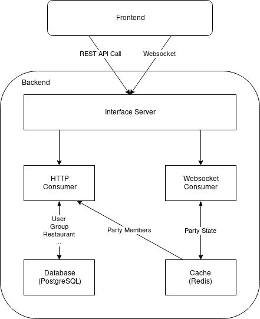
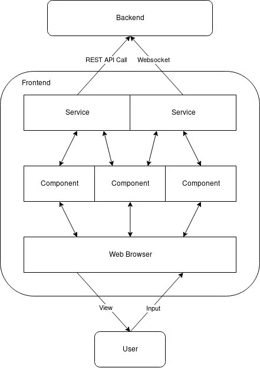
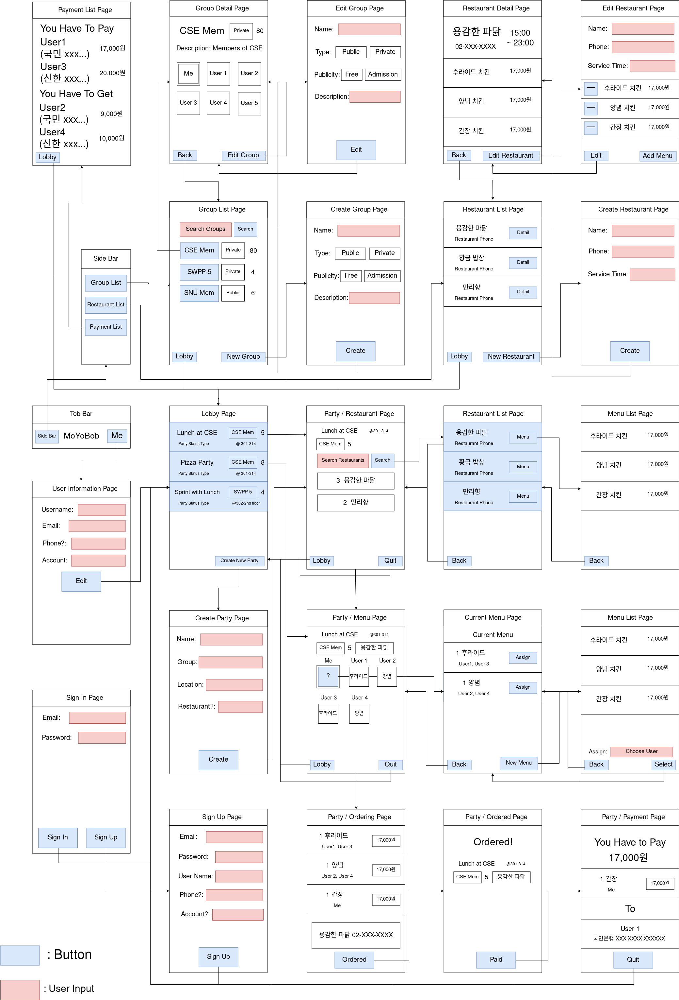

2018-11-05,
version 3.0

## Revision

- 1.0 2018-10-22 - initial document :tada:
- 2.0 2018-11-05 - Sprint 3
- 3.0 2018-11-19 - Sprint 4
- 4.0 2018-12-03 - Sprint 5
  - Deployment Architecture has been updated
  - Backend Design Detail has been updated

## [System Architecture]{.important}

### [Deployment Architecture]{.important}

\

- Docker and docker-compose for deploying
  - Easy to deploy
- Gunicorn for WSGI
  - Zero configuration
  - Small and fast
- Caddy for Web Server
  - Easy configuration
  - Automatic HTTPS

### Backend Architecture

{width=300px}\

- Websocket with Django Channels
- Cache with Redis

We decided to show information like party status, which needs to interact and be notified to users as they change the information, using Websocket and Cache.

### Frontend Architecture

{width=300px}\

- Websocket with rxjs
- Angular's Service-Component system

## Design Detail

### Frontend Design Detail

\

#### Common

This will be shown in every page.

- Top Bar Component
- Side Bar Component

##### Top Bar Component

Vertical Scrolling should hide this component in mobile landscape.
- Logo
- Side Bar Button : when pressed, shows the [Side Bar].
- My Info Button : when pressed, moves to [User Info].

##### Side Bar Component

Shown when pressing Side Bar Button in [Top Bar] Component.

- Payment List Button : when pressed, moves to [Payment List].

#### Lobby (`/party`)

The Main Page.

- Party List : Shows the party already joined at top. Clicking on a [Party] in the list moves to corresponding [Party].
  - Party Info
    - Party Name
    - Group Name
    - Number of Participants
    - Current State
    - etc
  - Make Party Button : when pressed, moves to [Create Party].

##### Create Party (`/party/create`)

Can create [Party].

- Party Name
- Party Characteristic
  - Public
  - Protected
  - Private
- Group Name : should hide when [Party] is public
- Place to Eat
- Restaurant : Optional, [Party] starts with status [Selecting Menu] when provided
- etc
- Submit Button : when pressed, creates a [Party], and moves to [the page of that Party](#Party).

#### Party (`/party/:id`)

Provides the main features such as choosing menus. Different infos are shown with respect to participation status and party status.

- Shows regardless of participation status
  - Party Name
  - Group Name
  - Number of Participants
  - Restaurant Chosen: if not chosen, blank
  - etc
  - Lobby Button : pressing this button won't leave the party
  - Leave Button
    - when pressed before the party is in `Select Menu` status, clear any information related to user;
    - when pressed after the party is in `Ordered`, leave the party with the history of party and payment information, and the payment information can be shown in [Payment List] Page.
- Not Participating
  - Clicking the Party in the Lobby changes the participation status to Participating
- Participating: when participating, shows the corresponding component.
  - [Selecting Restaurant]
  - [Selecting Menu]
  - [Ordering]
  - [Ordered]
  - [Payment]
  - [End]

##### Selecting Restaurant Component

- Search Restaurant : search with restaurant name and/or restaurant category.
  - Search Button : when pressed, moves to [Restaurant List]
- List of Selected Restaurant : most voted top
  - Pressing the restaurant votes for that restaurant.
  - Proceed Button : shown only to Party Leader, when pressed, restaurant selection is complete and moves to [Selecting Menu]

##### Selecting Menu Component

- User List : Users and their menus are shown, and mine should be the top. Pressing my list moves to [Menu List].
  - User Name
  - Menu : if no menus are chosen, shows the ? icon
  - Proceed Button : When every user presses the Proceed Button then the party status changes to [Ordering]

##### Ordering Component

- Payment Info
  - Users' name and price are shown for each menu
- Phone number for restaurant
- Ordered Button : shown only to Party Leader, when pressed, moves to [Ordered]

##### Ordered Component

- A message is shown to notify that the order is complete.
- Expected Time : Party Leader can put this. If not put, not shown.
- Payment Complete : shown only to Party Leader, when pressed, User List is shown, and selecting who paid for the meal moves to [Payment].

##### Payment Component

Shows the required amount of money to pay.

- how much one should pay
- the person who paid for the meal
- the means to pay the bill
  - Account Number etc; retrieved from user info or can register when the case is the user registered only for this party.
- menu one picked and the price

#### Menu List

Every user can select his or her menu.

- List of chosen menu
  - Pressing menu assigns oneself to the menu.
- Add Menu Button
  - when pressed, shows the list of all menus of the restaurant.
  - Selecting one or more menus, selecting assignees (can be none) and pressing Add Button adds the menu with corresponding information.

#### User Info (`/user/:username`)

Shows or modifies user information.

- Name
- E-mail
- Contact Info
- Payment Info
- Modify Button

#### Restaurant List Component

List all restaurants or search for the specific restaurant.

- Search Bar
- Search Button
- List of Restaurants
  - Restaurant Name
  - Restaurant Category

#### Payment List (`/payment`)

Shows every payment one made, either should pay or should be paid.

- Should Pay : shows every payment with the information of the same receiver merged.
- Should be Paid : shows every payment with the information of the same sender merged.

## [Backend Design Detail]{.important}

### In DB

Models stored in SQL Database

#### User

User object is provided by Django for authentication.

Use email and password for authentication and username as nickname.

- email
- password
- username

#### Party

- name: string
- type: SmallIntegerField with choces of PartyType
- location: string
- leader: ForeignKey of User
- since: datetime

##### PartyType

extends Enum

- values
  - `0`: InGroup
  - `1`: Private

#### Group

- name: string
- description: string
- type: SmallIntegerField with choices of GroupType
- publicity: SmallIntegerField with choices of GroupPublicity
- leader: ForeignKey of User
- members: ManyToManyField of User

##### GroupType

extends Enum

- values
  - `0`: Public
  - `1`: Private

##### GroupPublicity

extends Enum

- values
  - `0`: Free
  - `1`: AdmissionRequired

#### Restaurant

- name: string
- category: Category
- phone: string
- service_time_from: time
- service_time_to: time
- menus: ManyToManyField of Menu

#### Menu

- name: string
- price: integer

#### PaymentInformation

- user: OneToOneField of User
- phone_number: string (Nullable)
- bank: string (Nullable)
- account: string (Nullable)

#### [Payment]{.important}

- user: ForeignKey of User
- paid_user: ForeignKey of User
- menu: ForeignKey of Menu
- price: IntegerField
- resolved: BooleanField
- party_record: ForeignKey of PartyRecord

#### [PartyRecord]{.important}

- name: CharField
- type: SmallIntegerField
- location: CharField
- leader: ForeignKey of User
- since: DateTimeField
- until: DateTimeField
- members: ManyToManyField of User
- restaurant: ForeignKey of Restaurant
- paid_user: ForeignKey of User
- payments: related name of Payment

### [In Cache]{.important}

Models stored in Redis Cache

#### [PartyState]{.important}

PartyState is stored in Cache, not DB

cache key: `party:{id}`

- id: integer, same as Party's id
- phase: PartyPhase
- restaurant_id: id of Restaurant (Nullable)
- restaurant_votes: list of tuple (User's id, Restaurant's id)
- member_ids: list of User's id
- paid_user_id: id of User (Nullable)
- menu_entries: MenuEntries

##### PartyPhase

extends integer, and works like enum

- values
  - `0`: ChoosingRestaurant
  - `1`: ChoosingMenu
  - `2`: Ordering
  - `3`: Ordered
  - `4`: PaymentAndCollection

##### [MenuEntries]{.important}

list of tuple (id: integer, Menu's id, quantity: integer, list of User's id)

### [API]{.important}

#### [RESTful API]{.important}

- Status Code
  - `200`: Ok
  - `400`: Bad request
  - `403`: Forbidden or Not authorized
  - `404`: Not found
  - `405`: Method not allowed
- `/api/signin/`
  - `POST`: Sign in
    - Request: email and password of User
    - Response: User
- `/api/signup/`
  - `POST`: Sign up
    - Request: username, email, and password of User
    - Response: Empty
- `/api/user/`
  - `GET`: Get detail of current user
    - Request: Empty
    - Response: User
- `/api/user/<int:user_id>/`
  - `GET`: Get detail of user
    - Request: Empty
    - Response: User
- `/api/party/`
  - `GET`: Get list of parties
    - Request: Empty
    - Response: list of Party
  - `POST`: Create a new party
    - Request: name, type, and location of Party
    - Response: Party
- `/api/party/<int:party_id>/`
  - `GET`: Get detail of party
    - Request: Empty
    - Response: Party
  - `DELETE`: End the party
    - Request: Empty
    - Response: Empty
- `/api/group/`
  - `GET`: Get list of groups
    - Request: Empty
    - Response: list of Group
  - `POST`: Create a new group
    - Request: Empty
    - Response: Group
- `/api/group/<int:group_id>/`
  - `GET`: Get detail of group
    - Request: Empty
    - Response: Group
  - `PUT`: Edit detail of group
    - Request: Group
    - Response: Group
  - `DELETE`: Delete group
    - Request: Empty
    - Response: Empty
- `/api/restaurant/`
  - `GET`: Get list of restaurant
    - Request: Empty
    - Response: list of Restaurant
  - `POST`: Create a new restaurant
    - Request: Restaurant
    - Response: Restaurant
- `/api/restaurant/<int:restaurant_id>/`
  - `GET`: Get detail of restaurant
    - Request: Empty
    - Response: Restaurant
  - `PUT`: Edit restaurant
    - Request: Restaurant
    - Response: Restaurant
  - `DELETE`: Delete restaurant
    - Request: Empty
    - Response: Empty
- `/api/restaurant/<int:restaurant_id>/menu/`
  - `GET`: Get list of menu
    - Request: Empty
    - Response: list of Menu
  - `POST`: Create a new menu
    - Request: Menu
    - Response: Menu
- `/api/menu/<int:menu_id>/`
  - `GET`: Get detail of menu
    - Request: Empty
    - Response: Menu
  - `PUT`: Edit menu
    - Request: Menu
    - Response: Menu
  - `DELETE`: Delete menu
    - Request: Empty
    - Response: Empty
- `/api/party_records/`
  - `GET`: Get list of the user's party records
    - Request: Empty
    - Response: list of PartyRecord
- `/api/payments/`
  - `GET`: Get list of the user's unresolved payments
    - Request: Empty
    - Response: list of Payment
- `/api/collections/`
  - `GET`: Get list of the user's unresolved collections
    - Request: Empty
    - Response: list of Payment
- `/api/resolve_payment/<int:payment_id>/`
  - `GET`: Resolve the payment if the user is the paid user of the payment
    - Request: Empty
    - Response: Empty

#### [Websocket API]{.important}

JSON formatted protocol

Endpoint: `/ws/party/`

##### [Command]{.important}

Command is an action from frontend to backend

- PartyJoin
  - `command`: `"party.join"`
  - `party_id`: integer
  - Response: StateUpdate
  - Error: InitiallyNotJoined, InvalidDataError, InvalidPartyError, AlreadyJoinedError
- PartyLeave
  - `command`: `"party.leave"`
  - `party_id`: integer
  - Response: Nothing
  - Error: InvalidDataError, InvalidPartyError, NotJoinedError
- ToChoosingMenu
  - `command`: `"to.choosing.menu"`
  - `restaurant_id`: integer
  - Response: StateUpdate
  - Error: InvalidDataError, NotJoinedError, InvalidRestaurantError
- ToOrdering
  - `command`: `"to.ordering"`
  - Response: StateUpdate
  - Error: InvalidDataError, NotJoinedError
- ToOrdered
  - `command`: `"to.ordered"`
  - Response: StateUpdate
  - Error: InvalidDataError, NotJoinedError
- ToPayment
  - `command`: `"to.payment"`
  - `paid_user_id`: integer
  - Response: StateUpdate
  - Error: InvalidDataError, NotJoinedError, InvalidUserError
- RestaurantVoteToggle
  - `command`: `"restaurant.vote.toggle"`
  - `restaurant_id`: integer
  - Response: RestaurantVote, RestaurantUnvote
  - Error: InvalidDataError, NotJoinedError, InvalidRestaurantError
- MenuCreate
  - `command`: `"menu.create"`
  - `menu_id`: integer
  - `quantity`: integer
  - `user_ids`: list of integer
  - Response: MenuCreate
  - Error: InvalidDataError, NotJoinedError, InvalidMenuError, InvalidUserError
- MenuUpdate
  - `command`: `"menu.update"`
  - `menu_entry_id`: integer
  - `quantity`: integer
  - `add_user_ids`: list of integer
  - `remove_user_ids`: list of integer
  - Response: MenuUpdate
  - Error: InvalidDataError, NotJoinedError, InvalidMenuEntryError, InvalidUserError
- MenuDelete
  - `command`: `"menu.delete"`
  - `menu_entry_id`: integer
  - Response: MenuDelete
  - Error: InvalidDataError, NotJoinedError, InvalidMenuEntryError

##### [Event]{.important}

Event is an reply from backend to frontend and a communication in-between backend

- InvalidCommandError
  - `type`: `"error.invalid.command"`
- InvalidDataError
  - `type`: `"error.invalid.data"`
- InvalidUserError
  - `type`: `"error.invalid.user"`
- InvalidPartyError
  - `type`: `"error.invalid.party"`
- InvalidRestaurantError
  - `type`: `"error.invalid.restaurant"`
- InvalidMenuError
  - `type`: `"error.invalid.menu"`
- InvalidMenuEntryError
  - `type`: `"error.invalid.menu.entry"`
- NotJoinedError
  - `type`: `"error.not.joined"`
- AlreadyJoinedError
  - `type`: `"error.already.joined"`
- NotAuthorizedError
  - `type`: `"error.not.authorized"`
- InitiallyNotJoined
  - `type`: `"initial.not.joined"`
- PartyJoin
  - `type`: `"party.join"`
  - `user_id`: integer
- PartyLeave
  - `type`: `"party.leave"`
  - `user_id`: integer
- RestaurantVote
  - `type`: `"restaurant.vote"`
  - `restaurant_id`: integer
- RestaurantUnvote
  - `type`: `"restaurant.unvote"`
  - `restaurant_id`: integer
- MenuCreate
  - `type`: `"menu.create"`
  - `menu_entry_id`: integer
  - `menu_id`: integer
  - `quantity`: integer
  - `user_ids`: list of integer
- MenuUpdate
  - `type`: `"menu.update"`
  - `menu_entry_id`: integer
  - `quantity`: integer
  - `add_user_ids`: list of integer
  - `remove_user_ids`: list of integer
- MenuDelete
  - `type`: `"menu.delete"`
  - `menu_entry_id`: integer
- StateUpdate
  - `type`: `"state.update"`
  - `state`: PartyState
- LeaderChange
  - `type`: `"leader.change"`
  - `user_id`: integer

## Implementation Plan

### Basic Project Structure

#### Frontend Project

- Task
  1. Make new Angular Frontend Project
  1. Enter basic information of our Service (e.g. name)
  1. Generate Angular services and components including a routing module
- Iteration
  - Sprint 3
- Time Estimated
  - 1 hour

#### Backend Project

- Task
  1. Make new Django Backend Project
  1. Enter basic information of our Service (e.g. name)
  1. Generate Django apps, models and controllers
  1. Generate and migrate database
  1. If possible, generate Websocket app, too
- Iteration
  - Sprint 3
- Time Estimated
  - 1 hour

#### Basic Deployment Settings

- Task
  1. Write basic Dockerfile for Django application
  1. Write docker-compose wrapping Django, Caddy, and PostgreSQL containers
  1. Write CI configuration for Travis-CI
  1. If possible, write automatic deployment script for Angular application
- Iteration
  - Sprint 3
- Time Estimated
  - 2 hours

### Sign up and Sign in

#### User Model

- Task
  1. Generate User model consisting of ID, name, and password
  1. Implement authentication with user ID and password
- Iteration
  - Sprint 3
- Time Estimated
  - 4 hours

#### Login View

- Task
  1. Generate Login component and User Service
  1. Implement Login request in User service
  1. Implement Login view in Login component
- Iteration
  - Sprint 3
- Time Estimated
  - 3 hours

### Party

#### Party Model

- Task
  1. Generate Party model consisting of name, leader, and members
  1. Implement Creating Party API
  1. Implement Listing Party API
  1. Implement Joining Party API
- Iteration
  - Sprint 3
- Time Estimated
  - 4 hours

#### Making Party

- Task
  1. Generate Party component and Party Service
  1. Implement Creating Party request in Party Service
  1. Implement Party view in Party component
- Iteration
  - Sprint 3
- Time Estimated
  - 4 hours

#### Joining Party

- Task
  1. Generate Lobby component
  1. Implement Listing Party request in Party Service
  1. Implement Joining Party request in Party Service
  1. Implement Lobby view
- Iteration
  - Sprint 3
- Time Estimated
  - 4 hours

## Testing Plan

### Unit Testing

We will test every components and modules as implementation progresses. We will use the following frameworks and expect the code coverage is over 70%.

- Angular2: Jasmine & Karma
- Django: Python unit test

### Functional Testing

We will test all APIs by following frameworks. Since we use WebSocket, we will also make functional testing for that protocol.

- Angular2: Jasmine & Karma
- Django: Python unit test
- WebSocket protocol: Python unit test

### Acceptance & Integration Testing

As the goal of our project is to solve the real issues in the CSE club room, we would make much importance of beta testing. We will perform it with the help of our expected users, CSE students who try to order delivery food in CSE club room.

Since we use WebSocket API, providing mocks is hard. So we will do integration testing just like functional test which the mock does not exist. We will check front and backend integrated well.

- Acceptance(Beta): by CSE students who try to order delivery food
- Angular2: Jasmine & Karma
- Django: Python unit test
