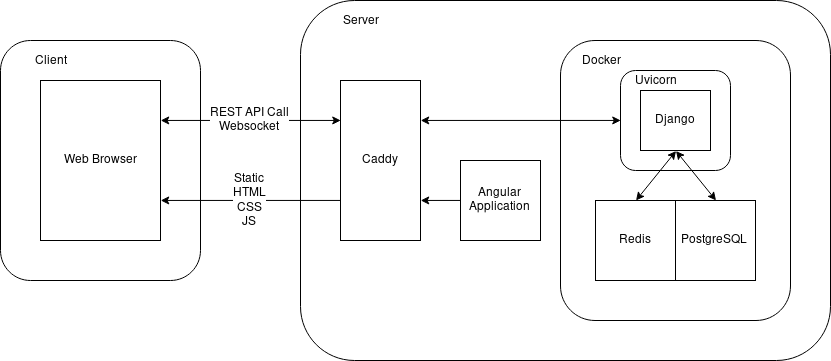

2018-11-05,
version 2.0

## Revision

- 1.0 2018-10-22 - initial document :tada:
- 2.0 2018-11-05 - Sprint 3
  - Model Design has been updated
  - View Design has been updated
  - Chagned parts are marked as [blue]{.important}

## System Architecture

### Deployment Architecture

\

- Docker and docker-compose for deploying
  - Easy to deploy
- Gunicorn for WSGI
  - Zero configuration
  - Small and fast
- Caddy for Web Server
  - Easy configuration
  - Automatic HTTPS

### Backend Architecture

{width=300px}\

- Websocket with Django Channels
- Cache with Redis

We decided to show information like party status, which needs to interact and be notified to users as they change the information, using Websocket and Cache.

### Frontend Architecture

{width=300px}\

- Websocket with rxjs
- Angular's Service-Component system

## [Design Detail]{.important}

### [Frontend Design Detail]{.important}

\

#### Common

- Top Bar Component
- Side Bar Component

##### Top Bar Component

- Logo : ``
- Side Bar Button : `<button>`
- My Info Button : `<button>`

##### Side Bar Component

Shown when pressing Side Bar Button in Top Bar Component.

- Group List Button : `<button>`
- Restaurant List Button : `<button>`
- Payment List Button : `<button>`

#### [Lobby Component]{.important} (`/party`)

The Main Page.

- Party List : `<ul>`
  - LobbyListItemComponent
- Make Party Button : `<button>`

##### [LobbyListItemComponent]{.important}

- Party Info : `
`
  - Party Name : ``
  - Group Name : ``
  - Number of Participants : ``
  - Current State : ``

##### [PartyCreate Component]{.important} (`/party/create`)

Can create [Party].

- Party Name : `<input>`
- Party Characteristic : `<select>`
  - Public : `<option>`
  - Protected : `<option>`
  - Private : `<option>`
- Group Name : `<input>`
- Place to Eat : `<input>`
- Restaurant : `<input>`
- Submit Button : `<button>`

#### [PartyComponent]{.important} (`/party/:id`)

Provides the main features such as choosing menus. Different infos are shown with respect to participation status and party status.

- Shows regardless of participation status
  - Party Name : `<h2>`
  - Group Name : `<h3>`
  - Number of Participants : ``
  - Restaurant Chosen: ``
  - etc
  - Lobby Button : `<button>`
  - Leave Button : `<button>`
- Not Participating
  - Clicking the Party in the Lobby changes the participation status to Participating
- Participating: when participating, shows the corresponding component.
  - Selecting Restaurant
  - Selecting Menu
  - Ordering
  - Ordered
  - Payment
  - End

##### Selecting Restaurant Component

- Search Restaurant : `<input>`
  - Search Button : `<button>`
- List of Selected Restaurant : `<ul>`; most voted top
  - Pressing the restaurant votes for that restaurant.
  - Proceed Button : `<button>`

##### Selecting Menu Component

- User List : `<table>`
  - User Name : ``
  - Menu : `
`
  - Proceed Button : `<button>`

##### Ordering Component

- Payment Info : `<ul>`
  - Users' name and price are shown for each menu (`<li>`)
- Phone number for restaurant : ``
- Ordered Button : `<button>`

##### Ordered Component

- A message is shown to notify that the order is complete.
- Expected Time : ``
- Payment Complete : `<button>`

##### Payment Component

Shows the required amount of money to pay.

- how much one should pay : `<h2>`
- the person who paid for the meal : `<h3>`
- the means to pay the bill : ``
  - Account Number etc; retrieved from user info or can register when the case is the user registered only for this party.
- menu one picked and the price : `<ul>`

#### Menu List

Every user can select his or her menu.

- List of chosen menu : `<ul>`
- Add Menu Button : `<button>`

#### User Info (`/user/:username`)

Shows or modifies user information.

- Name : ``
- E-mail : ``
- Contact Info : ``
- Payment Info : ``
- Modify Button : `<button>`

#### Group List (`/group`)

Shows the list of the group.

- Find Group : `<button>`
- Group List : `<ul>`
  - Group Name : ``
- Create Group Button : `<button>`

##### Group (`/group/:id`)

Shows or modifies the information of the group.

- Name : ``
- Description: ``
- Users : `<ul>`
- Leader : ``
- Edit Group Button : `<button>`

##### Edit Group (`/group/:id/edit`)

Shows the view to edit group.

- Group Name : `<input>`
- Characteristic : `<select>`
  - Public : `<option>`
  - Protected : `<option>`
  - Private : `<option>`
- Confirm Button : `<button>`

##### Create Group

Shows the view to add group. (`/group/create`)

- Group Name : `<input>`
- Characteristic : `<select>`
  - Public : `<option>`
  - Protected : `<option>`
  - Private : `<option>`
- Create Button : `<button>`

#### Restaurant List Component (`/restaurant`, `/party/:id`)

List all restaurants or search for the specific restaurant.

- Search Bar : `<input>`
- Search Button : `<button>`
- List of Restaurants : `<li>`
  - Restaurant Name : ``
  - Restaurant Category : ``

##### Edit Restaurant Component (`/restaurant/:id/edit`)

Shows the view to edit restaurant.

- Restaurant Name : `<input>`
- Phone Number : `<input>`
- Category : `<input>`
- Menu Remove Button : `<button>`
- Menu Add Button : `<button>`
- Confirm Button : `<button>`

##### Create Restaurant Component (`/restaurant/create`)

Shows the view to create restaurant.

- Restaurant Name : `<input>`
- Phone Number : `<input>`
- Category : `<input>`
- Create Button : `<button>`

#### Add Menu Component

Shows the view to add menus.

- Menu Name : `<input>`
- Price : `<input>`
- Confirm Button: `<button>`

#### Payment List (`/payment`)

Shows every payment one made, either should pay or should be paid.

- Should Pay : `<ul>`
- Should be Paid : `<ul>`

## [Backend Design Detail]{.important}

### [In DB]{.important}

Models stored in SQL Database

#### [User]{.important}

User object is provided by Django for authentication.

Use email and password for authentication and username as nickname.

- email
- password
- username

#### [Party]{.important}

- name: string
- type: SmallIntegerField with choces of PartyType
- location: string
- leader: ForeignKey of User
- since: datetime

##### [PartyType]{.important}

extends Enum

- values
  - `0`: InGroup
  - `1`: Private

#### [Group]{.important}

- name: string
- description: string
- type: SmallIntegerField with choices of GroupType
- publicity: SmallIntegerField with choices of GroupPublicity
- leader: ForeignKey of User
- members: ManyToManyField of User

##### [GroupType]{.important}

extends Enum

- values
  - `0`: Public
  - `1`: Private

##### [GroupPublicity]{.important}

extends Enum

- values
  - `0`: Free
  - `1`: AdmissionRequired

#### [Restaurant]{.important}

- name: string
- category: Category
- phone: string
- service_time_from: time
- service_time_to: time
- menus: ManyToManyField of [Menu]

#### Menu

- name: string
- price: integer

#### [PaymentInformation]{.important}

- user: OneToOneField of User
- phone_number: string (Nullable)
- bank: string (Nullable)
- account: string (Nullable)

### [In Cache]{.important}

Models stored in Redis Cache

#### [PartyState]{.important}

PartyState is stored in Cache, not DB

cache key: `party:{id}`

- id: integer, same as Party's id
- phase: PartyPhase
- restaurant: id of Restaurant (Nullable)
- members: list of User's id
- menus: list of tuple of User's id and Menu's id

##### [PartyPhase]{.important}

extends integer, and works like enum

- values
  - `0`: ChoosingRestaurant
  - `1`: ChoosingMenu
  - `2`: Ordering
  - `3`: Ordered
  - `4`: PaymentAndCollection

### [API]{.important}

#### [RESTful API]{.important}

| API Endpoint       | GET                        | POST                    | PUT                  | DELETE            |
| ------------------ | -------------------------- | ----------------------- | -------------------- | ----------------- |
| `/party/`          | Get list of parties        | Create a new party      | X                    | X                 |
| `/party/:id/`      | Get detail of party        | X                       | X                    | End the party     |
| `/group/`          | Get list of groups         | Create a new group      | X                    | X                 |
| `/group/:id/`      | Get detail of group        | X                       | Edit detail of group | Delete group      |
| `/signin/`         | X                          | Sign in                 | X                    | X                 |
| `/signup/`         | X                          | Sign up                 | X                    | X                 |
| `/user/`           | Get detail of current user | X                       | Edit current user    | X                 |
| `/user/:id/`       | Get detail of user         | X                       | X                    | X                 |
| `/restaurant/`     | Get list of restaurant     | Create a new restaurant | X                    | X                 |
| `/restaurant/:id/` | Get detail of restaurant   | X                       | Edit restaurant      | Delete restaurant |

#### [Websocket API]{.important}

JSON formatted protocol

Endpoint: `/ws/party/`

##### [Command]{.important}

Command is an action from frontend to backend

- PartyJoin
  - `command`: `"party.join"`
  - `party_id`: integer
- PartyLeave
  - `command`: `"party.leave"`
  - `party_id`: integer

##### [Event]{.important}

Event is an reply from backend to frontend and a communication in-between backend

- Success
  - `type`: `"success"`
  - `event`: string
- Error
  - `type`: `"error"`
  - `error`: string
- PartyJoin
  - `type`: `"party.join"`
  - `user_id`: integer
- PartyLeave
  - `type`: `"party.leave"`
  - `user_id`: integer

## Implementation Plan

### Basic Project Structure

#### Frontend Project

- Task
  1. Make new Angular Frontend Project
  1. Enter basic information of our Service (e.g. name)
  1. Generate Angular services and components including a routing module
- Iteration
  - Sprint 3
- Time Estimated
  - 1 hour

#### Backend Project

- Task
  1. Make new Django Backend Project
  1. Enter basic information of our Service (e.g. name)
  1. Generate Django apps, models and controllers
  1. Generate and migrate database
  1. If possible, generate Websocket app, too
- Iteration
  - Sprint 3
- Time Estimated
  - 1 hour

#### Basic Deployment Settings

- Task
  1. Write basic Dockerfile for Django application
  1. Write docker-compose wrapping Django, Caddy, and PostgreSQL containers
  1. Write CI configuration for Travis-CI
  1. If possible, write automatic deployment script for Angular application
- Iteration
  - Sprint 3
- Time Estimated
  - 2 hours

### Sign up and Sign in

#### User Model

- Task
  1. Generate User model consisting of ID, name, and password
  1. Implement authentication with user ID and password
- Iteration
  - Sprint 3
- Time Estimated
  - 4 hours

#### Login View

- Task
  1. Generate Login component and User Service
  1. Implement Login request in User service
  1. Implement Login view in Login component
- Iteration
  - Sprint 3
- Time Estimated
  - 3 hours

### Party

#### Party Model

- Task
  1. Generate Party model consisting of name, leader, and members
  1. Implement Creating Party API
  1. Implement Listing Party API
  1. Implement Joining Party API
- Iteration
  - Sprint 3
- Time Estimated
  - 4 hours

#### Making Party

- Task
  1. Generate Party component and Party Service
  1. Implement Creating Party request in Party Service
  1. Implement Party view in Party component
- Iteration
  - Sprint 3
- Time Estimated
  - 4 hours

#### Joining Party

- Task
  1. Generate Lobby component
  1. Implement Listing Party request in Party Service
  1. Implement Joining Party request in Party Service
  1. Implement Lobby view
- Iteration
  - Sprint 3
- Time Estimated
  - 4 hours

## Testing Plan

### Unit Testing

We will test every components and modules as implementation progresses. We will use the following frameworks and expect the code coverage is over 70%.

- Angular2: Jasmine & Karma
- Django: Python unit test

### Functional Testing

We will test all APIs by following frameworks. Since we use WebSocket, we will also make functional testing for that protocol.

- Angular2: Jasmine & Karma
- Django: Python unit test
- WebSocket protocol: Python unit test

### Acceptance & Integration Testing

As the goal of our project is to solve the real issues in the CSE club room, we would make much importance of beta testing. We will perform it with the help of our expected users, CSE students who try to order delivery food in CSE club room.

Since we use WebSocket API, providing mocks is hard. So we will do integration testing just like functional test which the mock does not exist. We will check front and backend integrated well.

- Acceptance(Beta): by CSE students who try to order delivery food
- Angular2: Jasmine & Karma
- Django: Python unit test
