## Abstract & Motivation

Every day in the SNU CSE club room, some problems happen repeatedly. Those are about ordering food delivery. Nearby student restaurants are not popular, so many students eat delivery food. They used to say, ‘I want somebody to develop for our mealtimes’. So we did. **_Moyobob_ will be a wonderful service for everyone who would like to eat delivery foods together. It will make the procedure more convenient and efficient.**

## Related Work
- SimpleRemittanceApp (e.g.Toss, KakaoPay)
  - differentiated by giving functions for organizing people and decision making(choosing restaurant, menu).
- DeliveryApp (e.g.Yogiyo, Baemin)
  - differentiated by giving functions for organizing people and collecting a bill.

## System Architecture

### Deployment Architecture

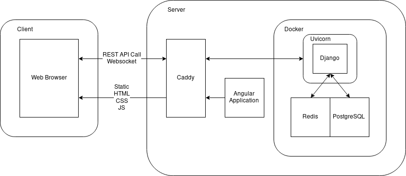\

1. Docker and Docker-Compose for deploying
    - Easy to deploy
    - Easy to scale (scale up with Docker Swarm)
1. Uvicorn for ASGI
    - Blazing Fast ASGI Server
    - Supports Websocket
1. Caddy for Web Server
    - Easy configuration
    - Automatic HTTPS

#### HTTPS

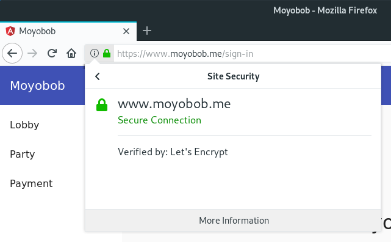\

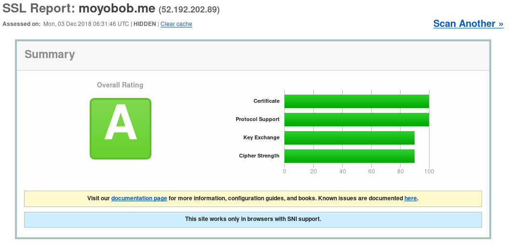\

- Dedicatied domain www.moyobob.me
- Full HTTPS support with Caddy
  - 'A' rated by Qualys SSL Test

#### Docker

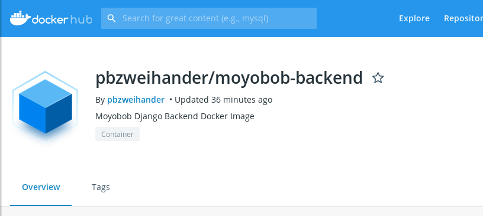\

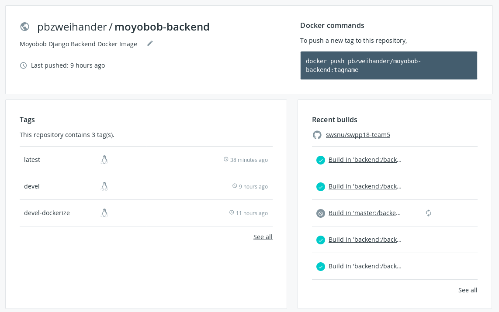\

- Easy and Fast Deployment with Docker
- Docker Image is built with Docker Hub Automated Build

### Backend Architecture

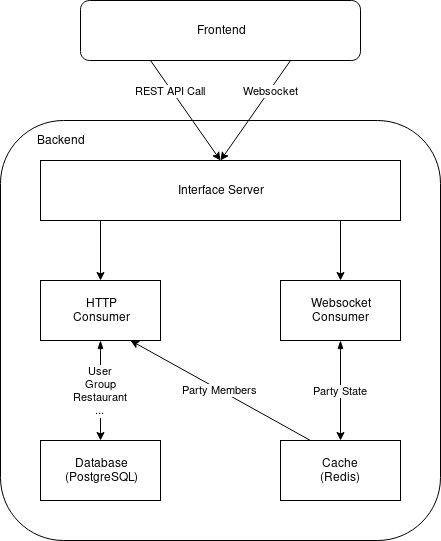\

1. Websocket with Django Channels
1. Cache with Redis
1. DB with PostgreSQL

### Frontend Architecture

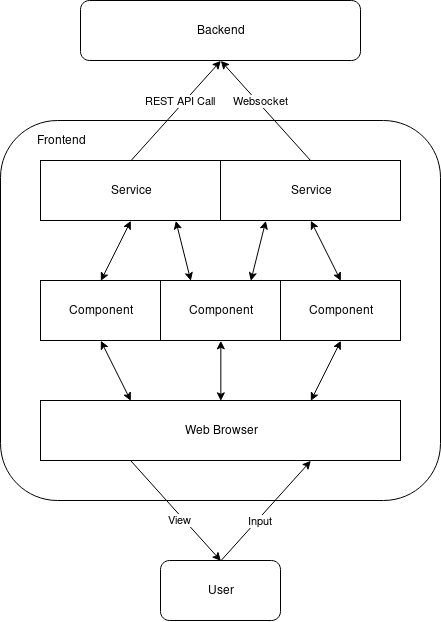\

1. Websocket with rsjs
1. Angular's Service-Component System

## Testing

### Continuous Integration

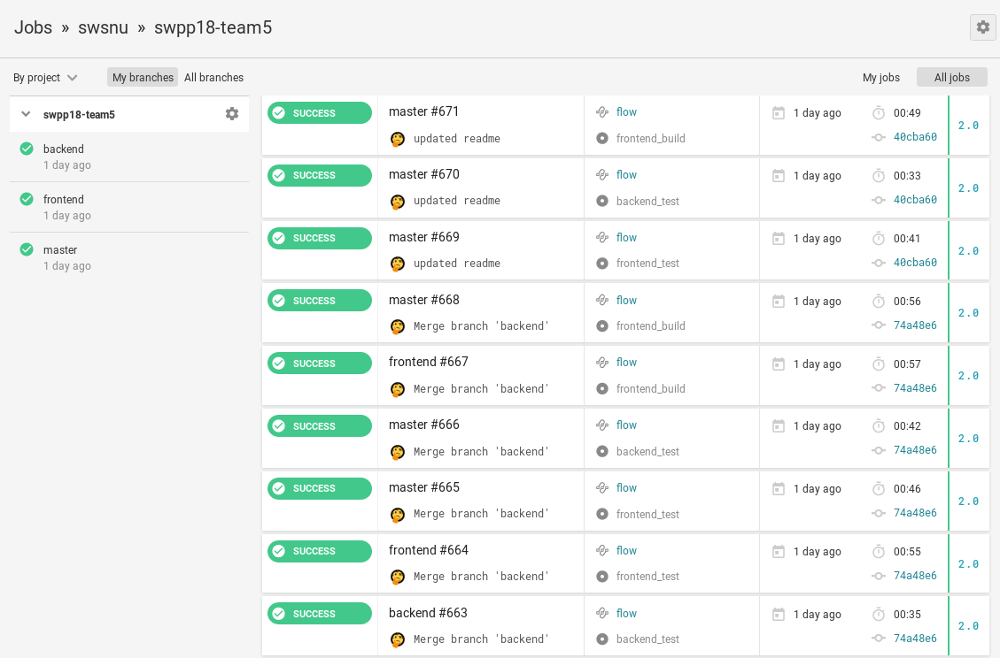\

- Automated testing & building on every push
- Seperated Frontend and Backend testing

### Code Coverage

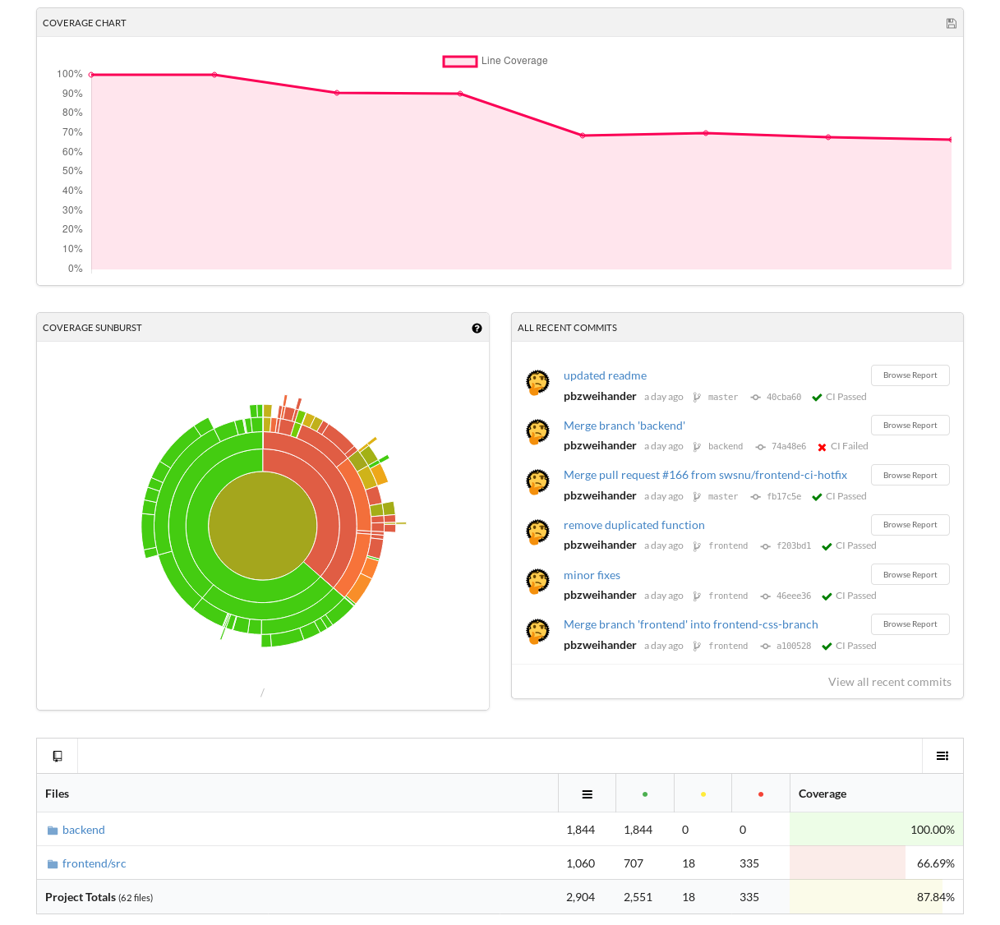\

- Tracking code and branch coverage with Codecov
- Coverage report is uploaded by CircleCI automatically

## User Interface

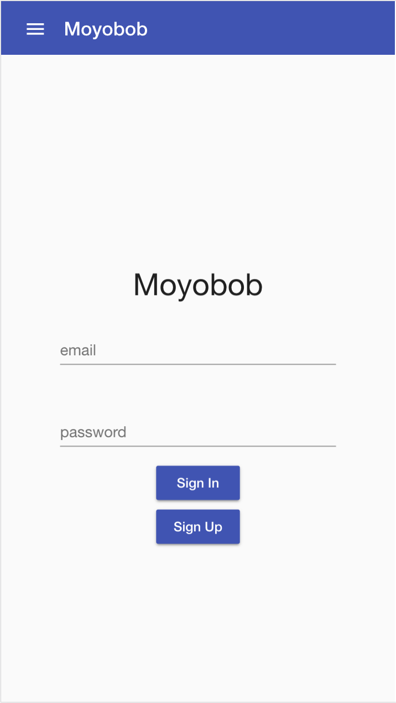{ width=24% }\ { width=24% }\ 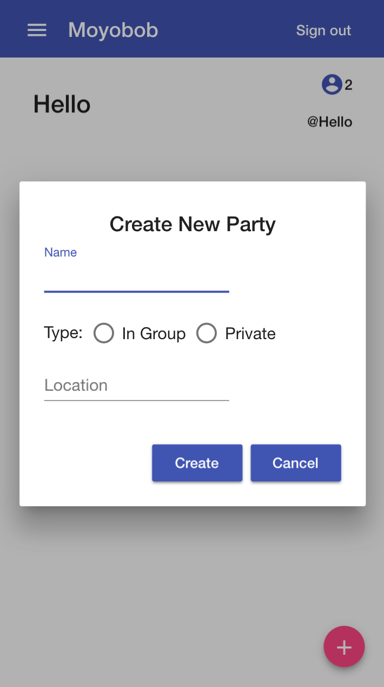{ width=24% }\ 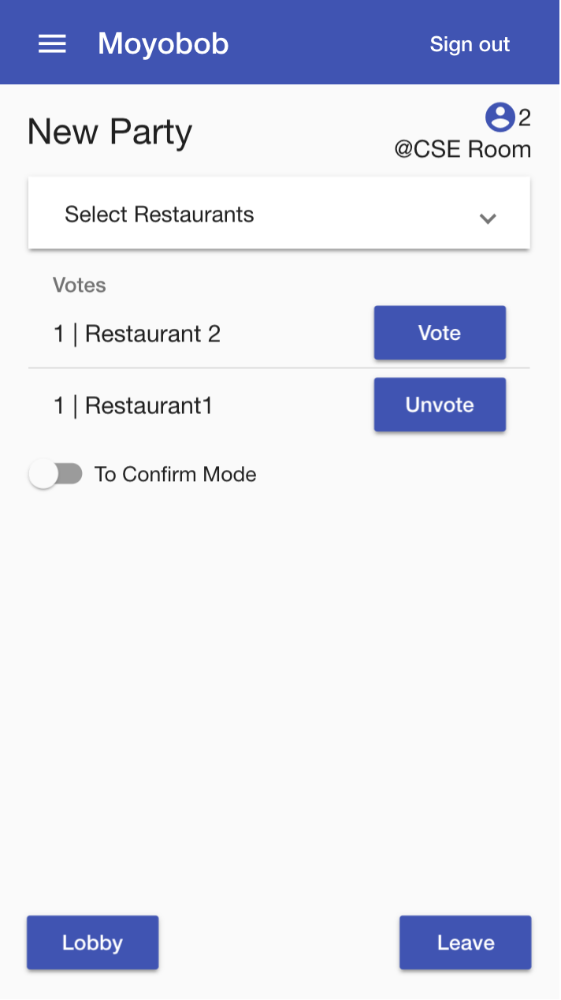{ width=24% }\
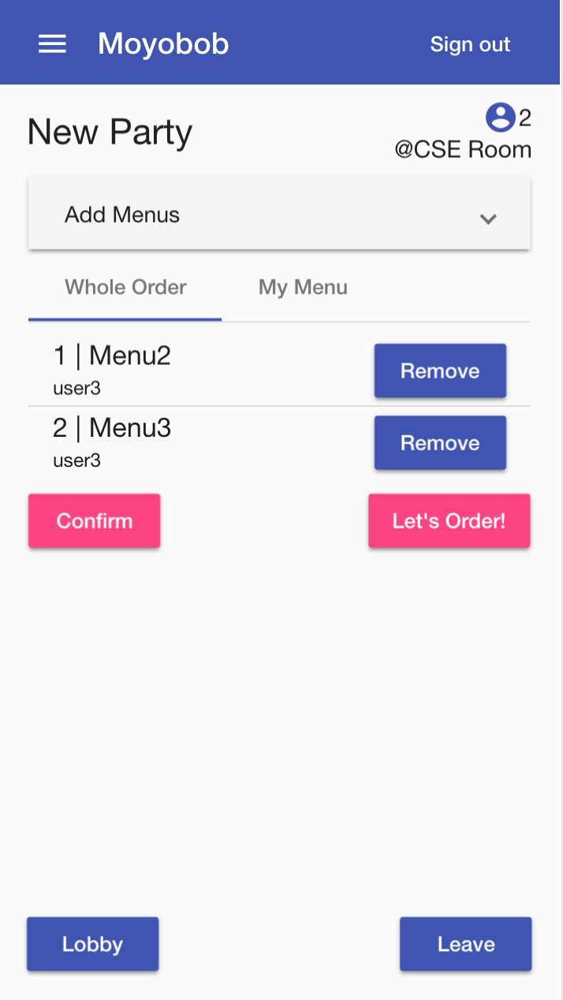{ width=24% }\ 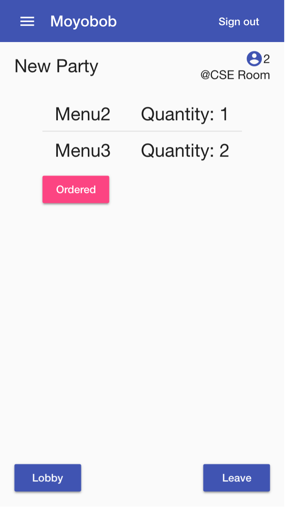{ width=24% }\ 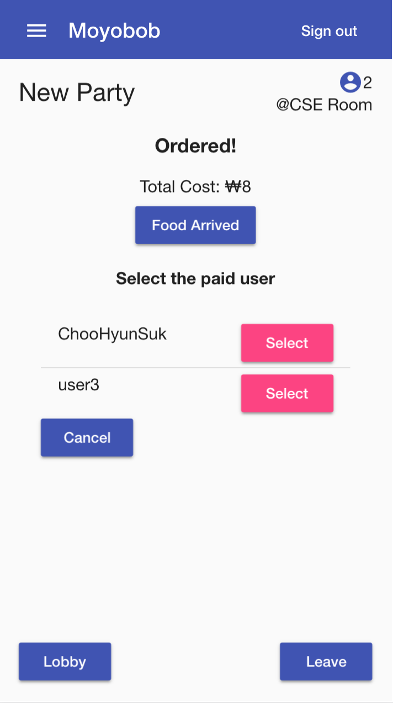{ width=24% }\ { width=24% }\

## Lessons learned & Conclusion
- Yeonghyeon Kim: I mostly learned in this class how to use GitHub - branching, committing to other than `master`, and resolving merge conflicts - to collaborate with others. Furthermore, before taking this course, I always developed Web services using vanilla js and pure css. I no longer fear the use of frameworks such as Angular and Django. On a side note: Angular testing was *way too* sophisticated to suit for one-semester course.
- Hyemin Kim: It was beneficial because I was able to experience developing a service in collaboration. I was also able to learn a lot from testing and fixing bugs. It would have been more helpful it there was a process of receiving feedback from real user of our service. 
- Hyunsuk Choo: I learned how to interact with teammates because it was my first team project. I learned how to use frameworks such as Django, Angular. It was such a great experience learning how to design UI. If I had more time, I would study more and make our service more convenient and beautiful.
- Kangwook Lee: It was my first time to collaborating with others to build a real running service. And I have great time with practicing sysadmin jobs such as deploying with Docker, managing AWS EC2 Spot instance, setting DNS with Cloudflare, etc. If I have more time and money, I could have set up more server and orchestrated with Docker Swarm.
