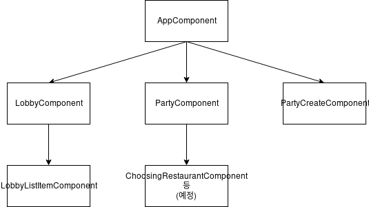

# Sprint 3

## Revision

* Updated Design & Planning 
  * Model Design
  * View Design

## Progress

#### Major Difficulties

* Dependency design 
* Modifications sharing
* Role distributing

#### Contributions

* Backend: Kangwook Lee
  * Party model
  * PartyState model
  * Party view
  * User authentication(signup, signin, signout view)
  * Websocket consumer
  * Redis cache setting
  * Dependency update(django_redis, django_channels)

* Frontend
  * Service
    * UserService implementation: Yeonghyeon Kim 
    * PartyService implementation: Hyunsuk Choo

  * Component  
    * SignInComponent: Yeonghyeon Kim
    *  LobbyComponent(in progress): Hyunsuk Choo 
    *  LobbyListItemComponent: Hyunsuk Choo
    *  PartyComponent(in progress) : Hyemin Kim

    

* Design & Planning update: Kangwook Lee

#### Test Coverage

* Tool: CircleCI, Codecov
* view of the test progress using CircleCI 

* The overall coverage metric

* The list of classes with lowest coverage: No class. The coverage of every class is 100%.

Sprint Report is written by Hyemin Kim
