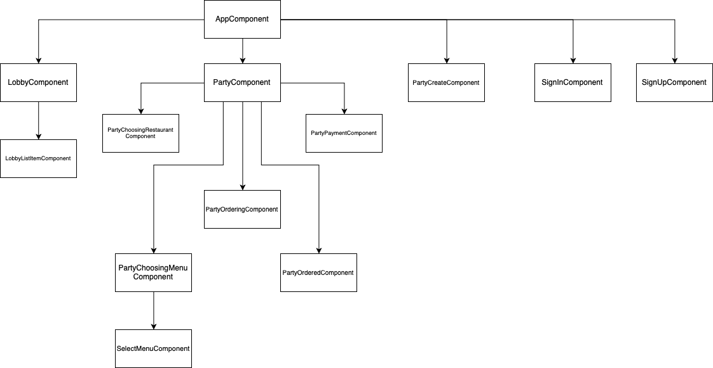
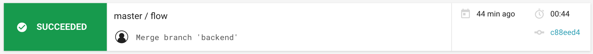
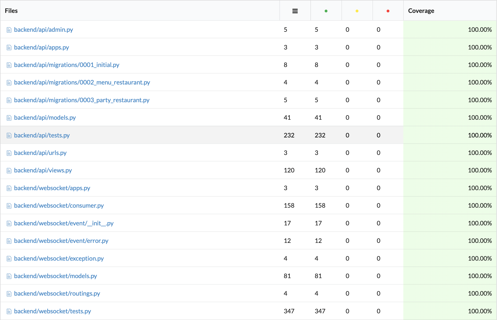
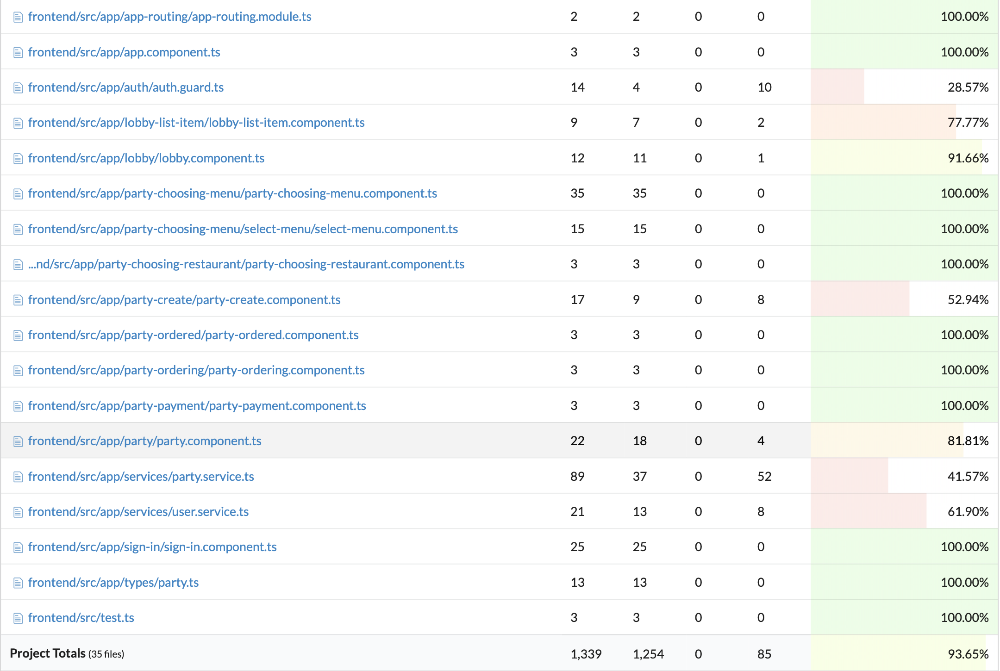

# Sprint 4

## Revision

* Updated Design & Planning
  * Model Design
  * View Design
* Updated Project Requirements & Specification
  * User Story

## Progress

#### Major Difficulties

* Component Dependency design
* Role distributing
* Menu Assign Algorithm
* WebSocket

#### Contributions

* Backend : Kangwook Lee
  * Custom User model
  * Menu model
  * Restaurant model
  * Party Detail view
  * Menu Assigning
  * Dependency update(django_channels)

* Frontend
  * Service
    * PartyService WebSocket implementation: Yeonghyeon Kim

  * Component
    * LobbyComponent : Hyunsuk Choo, Kangwook Lee
    * PartyComponent Refactoring : Yeonghyeon Kim

  * Setting
    * Proxy : Yeonghyeon Kim
    * CSRF : Yeonghyeon Kim
    * User Authentication : Yeonghyeon Kim

  * Component Dependency Graph : Hyunsuk Choo

  

* User Story : Hyemin Kim

* Design & Planning update : Yeonghyeon Kim

#### Test Coverage

* Tool: CircleCI, Codecov
* view of the test progress using CircleCI

* The overall coverage metric

* The list of classes with lowest coverage: auth.guard.ts

https://github.com/swsnu/swpp18-team5/releases/tag/sprint4

Sprint Report is written by Hyunsuk Choo
