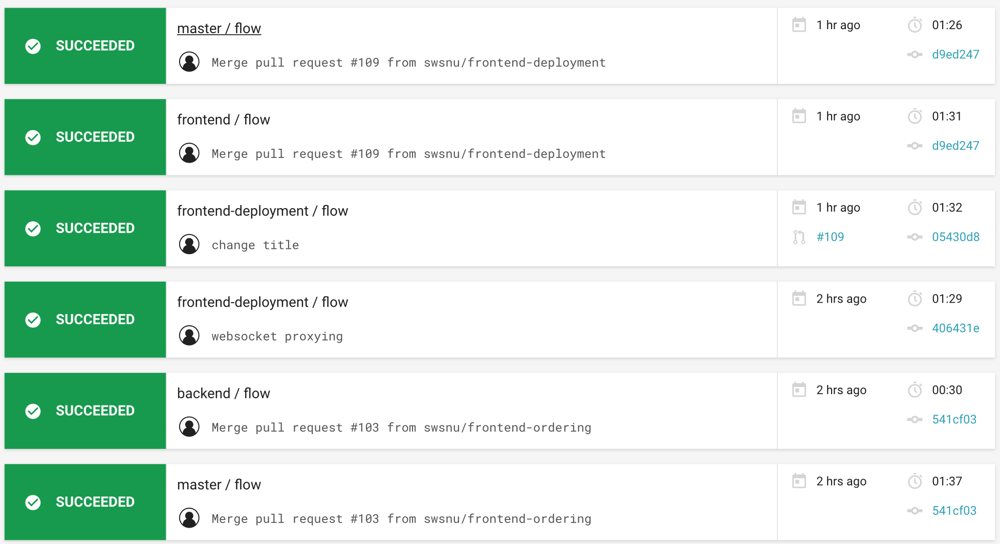
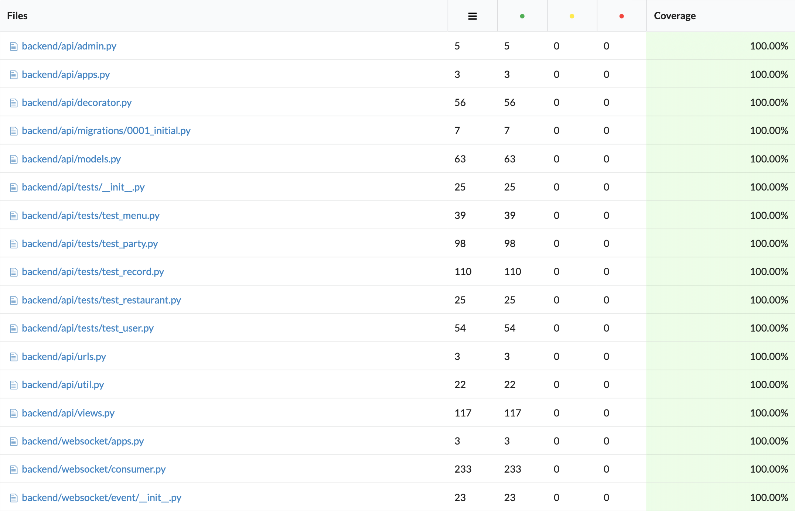
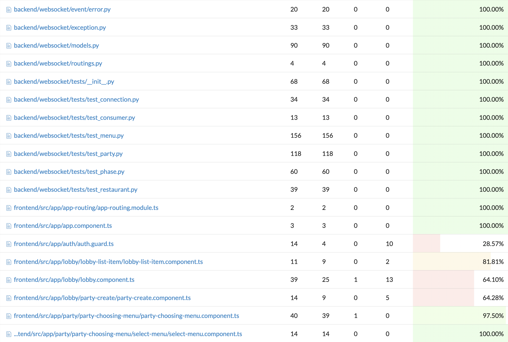
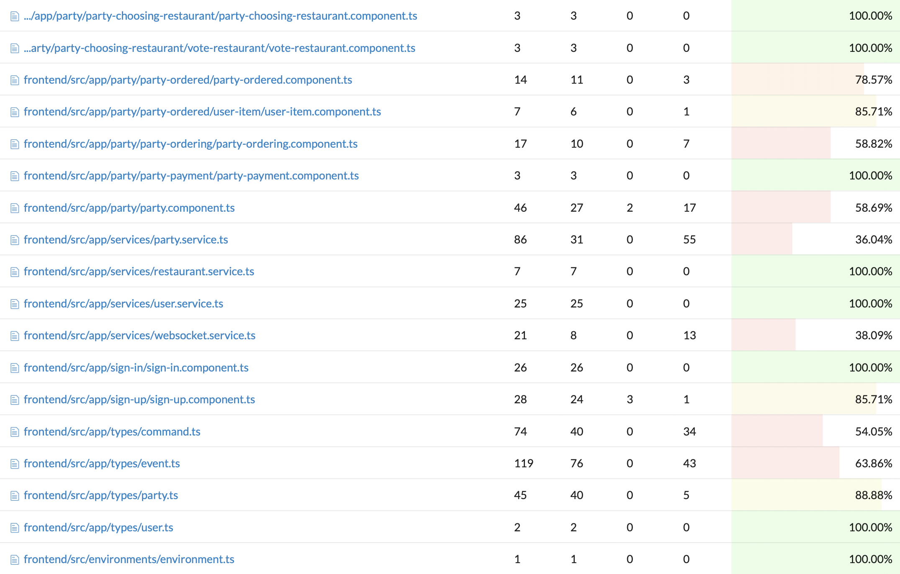
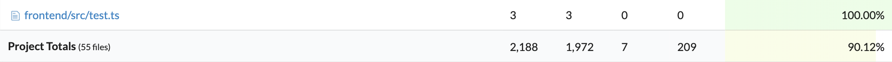
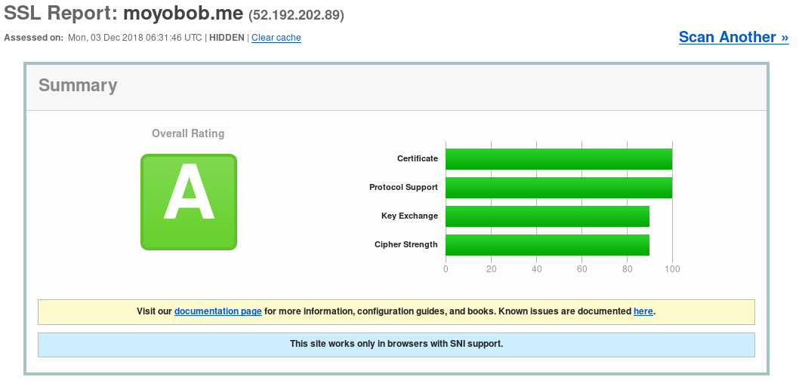

# Sprint 5

## Revision

* Updated Design & Planning 
  * Deployment Architecture

## Progress

#### Major Difficulties

* Frontend Component Dependency - We had too much dependency with each component. To lower dependency, we decided to reconstruct frontend using input and output
* Deployment Using Docker and Docker Compose
* Frontend Testing
* Implementing Major Features

#### Contributions

* Deployment Using Docker and Docker-compose : Kangwook Lee

* Backend : Kangwook Lee
  * Payment model
  * Party Phase Transition
  * Fixing Caddyfile
  * Code Refactoring

* Frontend
  * Code Refactoring (Reconstruction) : Kangwook Lee

  * Service
    * PartyService WebSocket implementation: Yeonghyeon Kim

  * Component
    * Sign Up Component : Hyemin Kim
    * Choosing Restaurant Component : Hyemin Kim
    * Choosing Menu Component : Yeonghyeon Kim
    * Ordering Component : Yeonghyeon Kim
    * Ordered Component : Yeonghyeon Kim

  * Testing : Yeonghyeon Kim

  * CSS : Hyunsuk Choo

* Design & Planning update : Kangwook Lee

#### Test Coverage

* Tool: CircleCI, Codecov
* view of the test progress using CircleCI 

* The overall coverage metric

* The list of classes with lowest coverage: auth.guard.ts, party.service.ts, websocket.service.ts

## Deployment

#### https://www.moyobob.me

#### SSL Test

#### HSTS

We disabled HSTS just for now, because this is not final release yet, so we cannot know whether we should change API endpoints.

Sprint Report is written by Hyunsuk Choo
